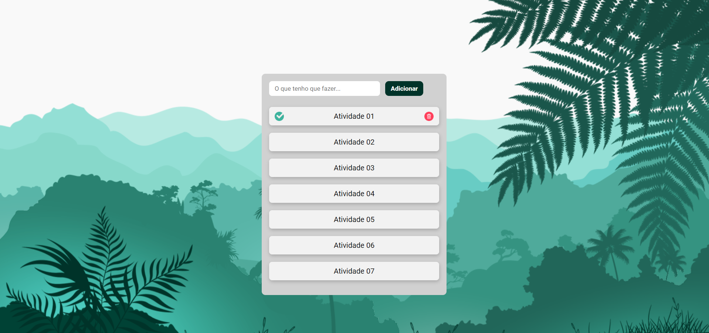

<h1>To-do list for the day</h1>
 

Projeto para listar seus afazeres do dia

 

A lista adiciona suas tarefas local Storage, ficando sempre salva mesmo que a PAG seja atualizada ou navegar seja fechado.

Tendo também a função de concluir a tarefa na lista e também de excluir.

    

Projeto passou por uma atualização, para melhorar a experiência do usuário.

    

 
<h2>Tecnologias usadas</h2>
<li>
    <ul>HTML</ul>
    <ul>CSS</ul>
    <ul>JavaScript</ul>
</li>

